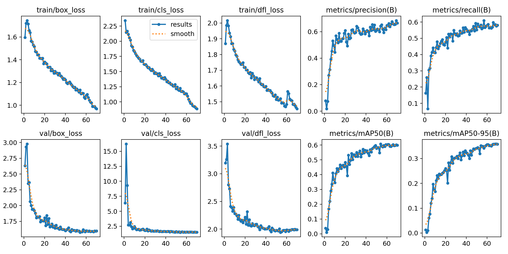

# Hotdog Detector

This project aims to develop a Hotdog Detector leveraging a pre-existing model YOLO v8n. The pre-trained model is fine-tuned with a dataset of approximately 3,000 images and corresponding labels. Specifically, supervised learning enables the model to tailor its detection capability and feature extraction to hotdogs, thereby optimizing the algorithm for single object detection. Additionally, hyperparameters such as batch size, learning rate, patience tolerance, and weight decay are tested and well-tuned. As a result, the after-trained model can correctly identify one or more hotdogs in a given image. 

## Table of Contents
- [Installation](#installation)
- [Usage](#usage)
- [Training Data Analysis and Potential Improvement](#training-data-analysis-and-potential-improvement)


## Installation
To set up this project on your local machine, follow these steps:

1. Navigate to the project directory:
   ```bash
   cd path-to-your-folder
   ```
2. Clone the repository:
   ```bash
   git clone https://github.com/PmmerHc/Hotdog-Detector.git
   ```
3. Install the required dependencies:
   ```bash
   pip install -r requirements.txt
   ```
## Usage
Once the project is set up, you can either train the model with the source code or use the trained Hotdog Detector to identify hotdogs in your images.
#### 1. Train a model
After installing all the dependencies, please set the path of your working directory in the directory_to_store_dataset variable in main.py within the src folder. Additionally, choose a directory to store the model after training and assign its path to the directory_to_store_model variable in main.py within the src folder.

Lastly, run the main.py file to begin the training. (Note: The use of a GPU is highly recommended.)
```bash
python your-path/main.py
```

#### 2. Identify hotdogs
Before starting the identification process, please provide either a URL or a path to the image and assign it to the img_path variable in the main function in run.py:
```python
    img_path = "paste your path here"
```

Then, run the run.py file. 

## Training Data Analysis and Potential Improvement
To objectively evaluate the model's performance, multiple mercies are adopted in the training process, for example, mAP50, mAP50-90, class loss, and box loss. Below are the graphs of each metric over time.


As seen in the graphs, while the loss calculations for the training dataset continue to decline, the validation dataset has already stabilized and converged to a value by the time of the 70th epoch. Even though the graphical representation of the values indicates a good learning slope, there is a potential overfitting concern with the current training configuration. Moreover, mAP50 is widely considered one of the most reliable indicators of the overall performance of an image recognition model. In this case, it levels off around 0.6 by the end of the training, suggesting that a moderate accuracy has been achieved and yet, there is still room for improvement.


While mAP50 and other loss calculations are significant in model training, the F1 vs, Confidence threshold curve also conveys important messages about the model. The F1 score represents the level of excellence in balancing Recall and Precision, a higher score is usually preferred and vice versa. In the curve above, the model exhibits low confidence when the F1 score is high and high confidence when the F1 is low or sometimes nearly 0. This result is not ideal and needs to be improved later on. 

Due to the lack of resources and time constraints of the project, here are some suggestions regarding next steps or approaches that enhance the model. 
- Enlarge the data sample size which directly allows the model to be more familiar with the object hotdog.
- Employ another YOLO v8 model (n, s, m, l, x)
- Further optimize hyperparameters (e.g. learning rate, batch size, weight decay, optimizer)
- Increase the number of epochs in the training loop and extend the training iterations to collect more data.

   
