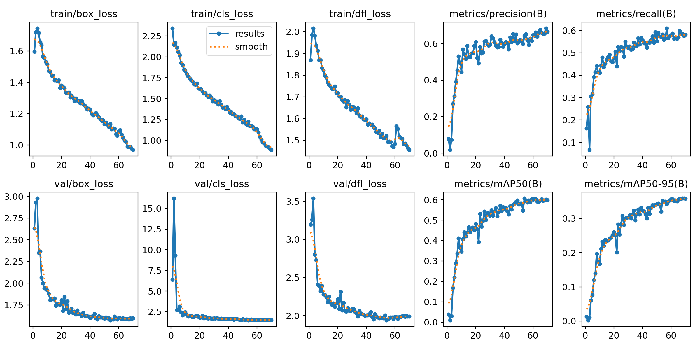
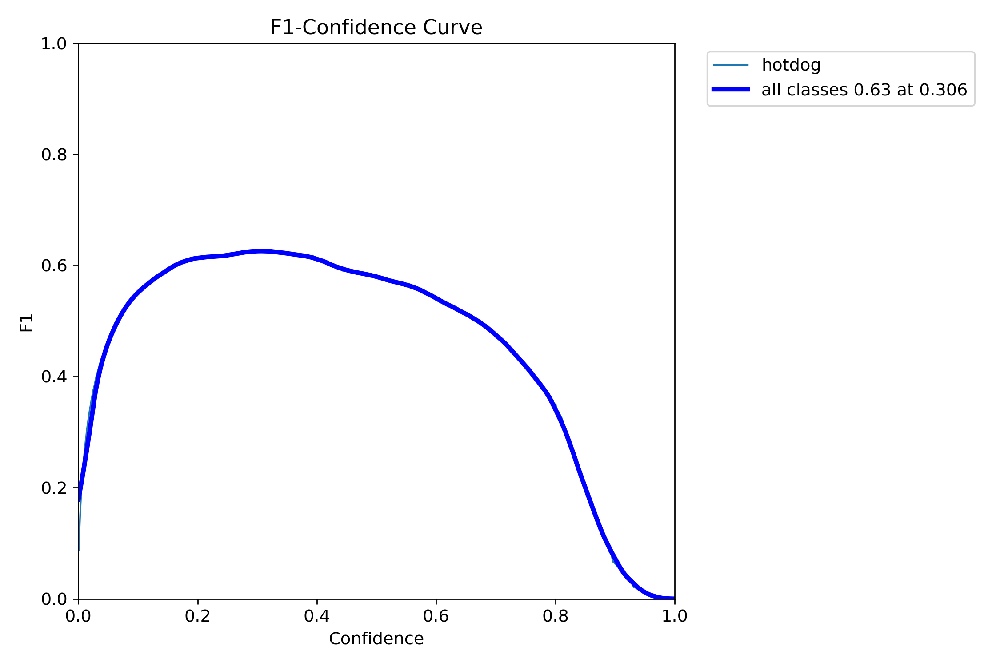

## Training Data Analysis
To objectively evaluate the model's performance, multiple metrics are adopted in the training process, for example, mAP50, mAP50-90, class loss, and box loss. Below are the graphs of each metric over time.

As seen in the graphs, while the loss calculations for the training dataset continue to decline, the validation dataset has already stabilized and converged to a value by the time of the 70th epoch. Even though the graphical representation of the values indicates a good learning slope, there is a potential overfitting concern with the current training configuration. Moreover, mAP50 is widely considered one of the most reliable indicators of the overall performance of an image recognition model. In this case, it levels off around 0.6 by the end of the training, suggesting that a moderate accuracy has been achieved and yet, there is still room for improvement.

While mAP50 and other loss calculations are significant in model training, the F1 vs, Confidence threshold curve also conveys important messages about the model. The F1 score represents the level of excellence in balancing Recall and Precision, a higher score is usually preferred. In the curve above, the model exhibits low confidence when the F1 score is high and high confidence when the F1 is low or sometimes nearly 0. This result is not ideal and needs to be improved later on. 

The graph illustrates the relationship between recall and the confidence threshold in the YOLO model. The area under the curve (AUC) of such a graph measures how well the model balances the true positive rate with various confidence levels. A high AUC score indicates that the model is able to maintain a decent recall even as the confidence threshold increases. In this case, the model receives an AUC score of 0.86, demonstrating strong performance in detecting hotdogs.

In conclusion, the fine-tuned YOLO model shows significant improvement over its original version in hotdog detection. Nearly all standard metrics suggest that the model is capable of detecting hotdogs effectively. Nevertheless, while measurements like mAP and mAP50-90 reveal an imbalance between recall and precision, other metrics such as AUC demonstrate strong overall performance. This suggests that, although there is room for optimization in certain areas, the model is well-suited  for the task of hotdog detection.

## Potential Improvement 
Due to the lack of resources and time constraints of the project, the following recommendations may further enhance the performance of the model:

- Enlarge the data sample size, allowing the model entirely tailor to hotdogs.
- Employ another YOLO v8 model (n, s, m, l, x)
- Experiment with various hyperparameter combinations (e.g. learning rate, batch size, weight decay, optimizer) to achieve more efficient learning and better overall performance
- Extend the training process by increasing the number of epochs and iterations to collect more valuable data for analysis.